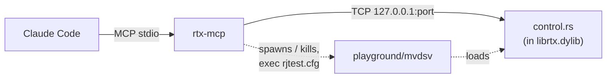

# rtx-mcp — the rtx bot control and tuning harness

An MCP (stdio) server that lets Claude Code drive rtx bots through scripted rocket-jump tests and
tune the driver knobs, without hand-flying bots in a live server.

## Pieces

- **Game side** (`crates/rtx-game/src/control.rs`): a cvar-gated (`rtx_control_port`) localhost TCP
  server. Inbound is line text `<id> <verb> args…`; outbound is one JSON line per reply/event. It
  puppets a bot: teleport it, order it to a position (`goto`) or to fly a specific rocket-jump link
  (`rj`), and emit per-attempt telemetry (`rj_result`) and reachability (`arrived`/`goto_stall`).
- **Runtime knobs** (`rtx_rj_*` cvars, read live): `stance`, `aim_tol`, `stance_timeout`,
  `liftoff_timeout`, `ballistic_slack`, and the two solve biases `delay_bias` (added to the fire
  delay) and `pitch_bias` (added to the fire pitch). Defaults mirror the driver constants, so an
  untouched server is unchanged.
- **This bridge** (`crates/rtx-mcp`): manages mvdsv, connects to the control port, exposes MCP tools.

## `playground/` prerequisites

`server_start` / `server_restart` run mvdsv out of `playground/` (gitignored, not checked in).
That directory needs `mvdsv` / `mvdsv.exe` and `id1/pak0.pak` + `id1/PAK1.PAK` present already —
everything else (test `.bsp`s under `qw/maps/`, the `qwprogs` module, `qw/rjtest.cfg`) is either
fetched separately or staged automatically by this bridge.

In particular, the `qwprogs` module (`qw/qwprogs.dll` / `.so` / `.dylib` — the `rtx` cdylib mvdsv
loads as its game logic) does not need copying in by hand. Before every launch,
`server_start`/`server_restart` copy the newer of `target/release` and `target/debug` over
whatever is staged, so a fresh `cargo build -p rtx-game` is what gets tested — the returned status
names the build under `module`. Pass `install_module=false` to skip the copy and reuse the staged
module as-is. With nothing built and nothing staged, the call fails telling you to
`cargo build --release -p rtx-game` first, rather than dropping mvdsv into a doomed
connection-refused loop.

## Use

Registered in the repo-root `.mcp.json` as `rtx-mcp`. After a Claude Code session restart (or
`/mcp`), approve it, then:

1. `server_start(map="aerowalk")` — launches mvdsv with the harness config (1 bot, control port
   open, all build-gating cvars set explicitly), waits for the navmesh + bot, returns status.
2. `list_rj_links` — every rocket-jump link: id, source/target, solved fire pitch/yaw, delay,
   airtime, self-damage.
3. `test_link(link=…)` / `test_links()` — prep the bot, place it at the source (teleport, or
   `via:"goto"` to also test reachability), fire the jump, return the telemetry.
4. `set_knobs(delay_bias=-0.08, …)` then re-test to tune. `get_knobs` reads them back.
5. `console_cmd("map bravado")` to switch maps (re-list links afterward — ids are not stable).

Every tool takes an optional `bot` (defaults to the first live bot). Reachability stalls
(no progress ~4 s) surface as `goto_stall` — the signal that a rocket-jump *source* cell can't be
stood on.

For live strategy work, `server_connect` attaches without taking ownership of an existing server.
`status` reports match state plus each bot's team, stack, inventory, item goal, posture, enemy, and
route head; `bot_route` expands the full route and `inspect_cell` explains its nearby nav links.
`get_cvar`/`set_cvar` provide validated setup access; `set_cvars` accepts an ordered list of
`{"name":"…","value":"…"}` assignments and returns every individual result. `match_start` locks
the current roster and waits through the reload until the timed match, navmesh, and rostered bots
are all ready.

## Tool reference

The server self-describes over MCP `tools/list` (name, description, JSON input schema) — that is
the source of truth a client sees. This table is a convenience map of the full surface; every tool
that acts on a bot takes an optional `bot` (defaulting to the first live one).

**Server & session**

| tool | what it does |
|------|--------------|
| `server_start(map?, port?, skill?, install_module?)` | Launch mvdsv with the harness config (1 bot, control port open); stages the freshest local build as the qwprogs module first (unless `install_module=false`), then waits until the navmesh and a bot are ready. |
| `server_restart(…)` | Same arguments and staging as `server_start`; rebuilds a fresh navmesh (link ids are not stable across it). |
| `server_stop()` | Stop the managed mvdsv process and close the control connection. |
| `server_connect(port?)` | Attach to an already-running control port without starting, reconfiguring, or owning the server. |
| `server_log(lines?)` | Tail the managed server's console output. |
| `list_maps(filter?)` | List maps loadable from `playground/` — loose `.bsp` plus `maps/*.bsp` inside the paks — optionally narrowed to a case-insensitive substring. Needs no server; always returns a list. |

**Inspection**

| tool | what it does |
|------|--------------|
| `status()` | Map/navmesh, match format/phase/scores/roster, and each bot's team, stack, inventory, posture, perceived enemy, item plan, and route head. |
| `items()` | The map's bot-goal items (armor, health, weapons, ammo, powerups): each with its entity origin, whether it's currently available, and the nearest navmesh cell — the standable `goto` target. |
| `bot_route(bot?)` | Dump a bot's full planned route as link ids, kinds, and source/target positions. |
| `inspect_cell(x, y, z)` | The navmesh cell nearest a point: incoming/outgoing link kinds, costs, and hazards. |
| `list_rj_links()` | Every rocket-jump link: id, source/target, solved fire pitch/yaw, delay, airtime, self-damage. |
| `list_curl_links()` | Generated curl-jump links: run-up, takeoff, target, required speed, and gain. |

**Cvars & knobs**

| tool | what it does |
|------|--------------|
| `get_cvar(name)` | Read a live cvar as both its exact string and numeric value. |
| `set_cvar(name, value)` | Set a live cvar through the validated control protocol. |
| `set_cvars(cvars[])` | Set an ordered list in one call; every pair is attempted and its result/error returned in order. |
| `get_knobs()` | Read back the current `rtx_rj_*` knob values. |
| `set_knobs(…)` | Set any of the `rtx_rj_*` driver knobs (stance, aim_tol, timeouts, biases); only passed fields change. |

**Match & bot control**

| tool | what it does |
|------|--------------|
| `match_start()` | Lock the current roster, reload, run the countdown, and return once the match is live with navmesh and bots ready. |
| `prep(bot?, health?, rockets?)` | Make a bot fit to rocket-jump: set health, give and select the RL with rockets, clear quad, take it off cooldown. |
| `teleport(bot?, x?, y?, z?, link?)` | Teleport a bot to a point (or, with `link`, that rj link's source cell), zeroing momentum and nav state. |
| `goto(bot?, x, y, z, timeout?)` | Order a bot to walk to a point, awaiting `arrived` or (no progress ~4 s) `goto_stall`. |
| `corridor_test(start, end, …)` | Repeatedly run the pathfinder/bhop down one corridor; reports drift, peak speed, heading error, reverse frames, hop state. |

**Rocket-jump testing**

| tool | what it does |
|------|--------------|
| `rocket_jump(bot?, link, timeout?)` | Fly one rj link and await the full `rj_result` telemetry (stance, aim, fire-timing, landing miss, outcome). |
| `test_link(link, via?, bot?)` | End-to-end test of one rj link: prep, place (`teleport`, or `via: goto` to also test reachability), fire, return telemetry. |
| `test_links(links?, via?)` | Sweep a batch (default: all links on the map); per-link results plus a summary. |

**Escape hatch**

| tool | what it does |
|------|--------------|
| `console_cmd(command)` | Run a raw server console command (e.g. `map bravado`, `set sv_gravity 700`). A command containing `map` invalidates the cached link list. |

## The config quirk it exposes

On a fresh boot the first map's navmesh builds with **rocket jumps gated off** (`rjump 0`): the
gating cvars (`rtx_bot_rocketjump`, etc.) are seeded by the module's `GAME_INIT` `cvar_default`,
whose queued `set` flushes only *after* the first-frame navmesh build reads them. A later `map`
rebuilds correctly (`rjump 531` on aerowalk). The harness config sets those cvars explicitly before
`map` so the first build already has them; a real server would want the same, or a root fix in the
build-cvar flush timing.
